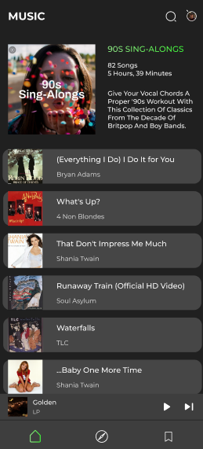
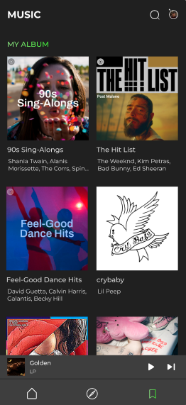
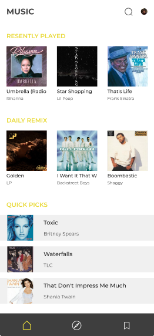

# PlayMe

------------------------

### What is it?

The PlayMe application is a music player that combines all the best features of popular music services such as YouTube Music, SoundCloud and Spotify. With its help, users can enjoy music in high quality, create their own playlists, share their favorite tracks with friends and discover new artists and albums. Thanks to an intuitive interface and the possibility of registering an account, PlayMe becomes a reliable partner for all music lovers who want to enjoy music anytime and anywhere.

### About development

App now is still being developed so many function are now don`t implemented into project.

### How programm will looks like?

Friend of mine are currently studying Figma and design web-applications so i asked her to do one for me :) 

Scetches:

  
  

### What programm will have in further development?

- **You can do your own playlists and listen others playlist which they create** 
  Group up all your favourite songs in one album and let other hear it!
- **Share music with your friend** 
  Share music you like with your friend so you don`t feel lonely
- **Add your own created music** 
  Log in to the program in order to download your created music

Thank for the attention!